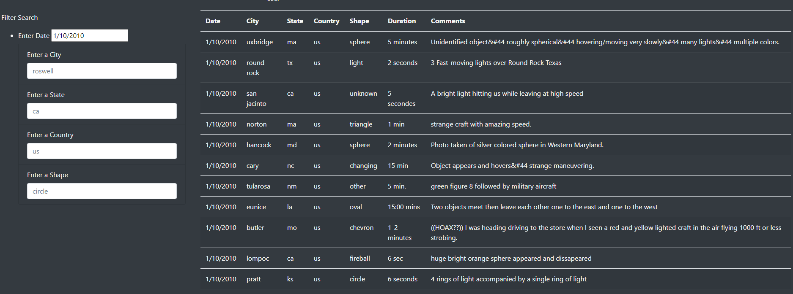
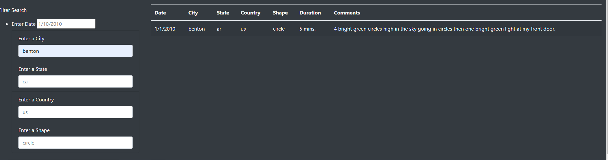

# UFO's

### Overview of the Project:
 A more in-depth analysis of UFO sightings by allowing users to filter for multiple criteria at the same time. In addition to the date, table filters have been added for the city, state, country, and shape.

### Results  Filter UFO sightings on multiple criteria
As you can imagine, UFO's are one of the hottest topics online. We were able to create a webage to pull some of the amazing sightings online. 
Individuals can search for a sighting on a specific date by State, City and even type of shape. Once the data pulls up the information, you will have 
access to individual statements about thier personal sightings. It is amazing to keep up to date with live data as it comes in!

DATE SEARCH:

### Written report on the UFO Anlaysis:
Even though most UFO enthuiast loves a good lead about sightings, individuals love being able to navigate through a site at ease. As the picture below indicates this 
site is user friendly. The Data found, can be used to analyze information such as frequencey of sightings tpyes and shapes of objects sighted and even closeness to neigborhoods.

CITY SEARCH:

### Summary: 
One of the drawbacks of our new site, is the limited depth of the stories behind the sighting. It would so much more amazing, and a definite recommendation, to have 
our comments act as a title to a deeper storyline, capturing the individual's experience. While many were able to find sightings that were of interest, we look forward to adding more content and image archives that could be of a greater value to our visitors. 

SEE MORE!:

